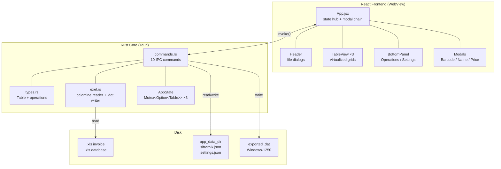
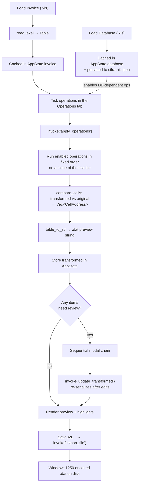
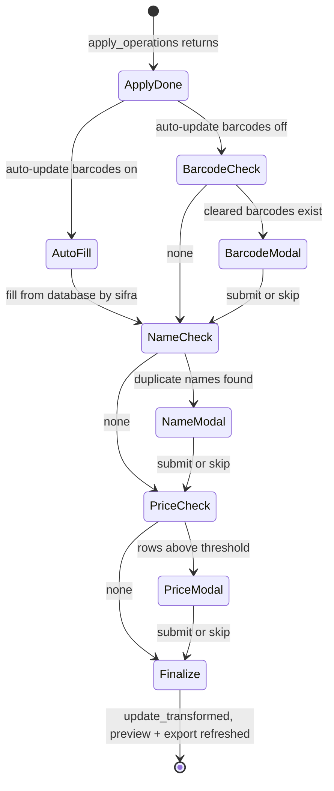

# Honey

A desktop app for automated invoice processing against a product database (*šifarnik*). Load a supplier invoice, run a batch of normalization operations against your product master data, review anything ambiguous in a guided modal flow, and export a POS-ready `.dat` file.

Built with **Tauri 2** (Rust core) + **React 19** (Vite frontend).

---

## Table of Contents

- [Why](#why)
- [Architecture](#architecture)
- [Data Model](#data-model)
- [The Processing Pipeline](#the-processing-pipeline)
- [Operations Reference](#operations-reference)
- [Interactive Review Chain](#interactive-review-chain)
- [Export Format](#export-format)
- [User Interface](#user-interface)
- [Persistence](#persistence)
- [IPC Command Reference](#ipc-command-reference)
- [Getting Started](#getting-started)
- [Project Structure](#project-structure)
- [Tech Stack](#tech-stack)
- [Behavioral Notes & Known Limitations](#behavioral-notes--known-limitations)
- [License](#license)

---

## Why

Built for a large makeup distributor that was spending hours every week manually processing supplier invoices — matching product codes against their database, clearing malformed barcodes, correcting item names, normalizing decimal separators and precision, and checking margins line by line. All repetitive, error-prone work on files with thousands of rows.

Honey automates the mechanical parts in bulk while keeping a human in the loop for the judgment calls. Everything the machine can decide, it decides; everything it can't, it surfaces in a review modal with the context needed to answer in seconds. Load a file, click **Apply**, resolve the flagged items, export. What used to take hours takes minutes.

---

## Architecture

Honey is a thin React presentation layer over a Rust data core. The frontend owns UI state, file dialogs, and the review flow; the backend owns parsing, all row transformations, diffing, and file I/O. They talk exclusively over Tauri's `invoke()` IPC.



**Why the split matters:** transformations run over every row of a multi-thousand-row invoice. Doing that in Rust keeps the UI thread free and the round trip effectively instant, while the frontend never has to re-implement any business rule — it receives a finished table plus a list of changed cells.

`AppState` holds three tables behind mutexes for the lifetime of the session:

| Field | Contents |
|-------|----------|
| `invoice` | The original, untouched invoice as parsed |
| `transformed` | The current working copy — updated after each apply and after each modal submission |
| `database` | The šifarnik (product master data) |

The `transformed` table is the single source of truth for export. `export_file` never takes data as an argument; it serializes whatever is currently in state, which guarantees that what you see in the export pane is exactly what lands on disk.

---

## Data Model

Everything is modeled as a `Table`:

```rust
pub type Row = IndexMap<String, String>;

pub struct Table {
    pub headers: Vec<String>,
    pub rows: Vec<Row>,
}
```

`IndexMap` is deliberate — it preserves the original Excel column order through the entire read → transform → export pipeline, so a rendered table and a written file always match the source layout. All cell values are strings; numeric coercion happens at the point of use, which keeps values that don't parse from being silently destroyed.

### Expected columns

Column names are matched **exactly** and are case-sensitive. Honey looks up columns by name, not position, so extra or reordered columns are harmless — but a renamed column means the corresponding operation silently does nothing.

**Invoice** (Serbian headers, as produced by the supplier's system):

| Column | Used by |
|--------|---------|
| `Šifra artikla` | Name lookup, duplicate detection, all review modals, export |
| `Naziv artikla` | Name update, duplicate-name detection, export |
| `Bar kod` | Barcode cleanup + auto-fill, export |
| `Količina` | Export |
| `Ukupna cena` | 4-decimal formatting, margin calculation, export |
| `Cena MP` | 2-decimal formatting, margin calculation, price review, export |

**Database / šifarnik** (lowercase headers):

| Column | Used by |
|--------|---------|
| `sifra` | Join key against `Šifra artikla` |
| `naziv` | Source of correct product names |
| `barkod` | Source for barcode auto-fill (read on the frontend) |

### Excel parsing

Files are read with [`calamine`](https://github.com/tafia/calamine), first worksheet only, first row treated as headers. Cell coercion (`exel.rs`):

- **Empty** → `""`
- **Int** → decimal string
- **Float** → rendered as an integer when within `0.0001` of a whole number, otherwise as-is. This is what stops quantities from arriving as `3.0000000004`.
- **Bool / DateTime / Error** → stringified
- **String** → NFC-normalized (so composed and decomposed forms of `š`, `ć`, `č` compare equal) and right-trimmed

---

## The Processing Pipeline



### Fixed execution order

Operations always run in this order inside `apply_operations`, regardless of the order you tick the checkboxes:

1. `update_names`
2. `detect_duplicate_names`
3. `format_col_and_mp_price_2_dec`
4. `format_price_4_dec`
5. `remove_duplicate_barcodes`
6. `swap_commas_to_dots`
7. `auto_update_price`

The order is deliberate: names are corrected before duplicates are detected against them, and detection passes (`detect_duplicate_names`, `auto_update_price`) read the already-transformed table so the flagged values match what you see in the preview.

### Change tracking

After the operations run, `compare_cells` walks the transformed table cell by cell against the original and emits a `CellAddress { row, col }` for every difference. That list drives:

- Cell highlighting in the preview pane
- The before/after tooltip (`− original` / `+ current`) on hover
- The "Updated *N* cells" log line

Edits made through the review modals append their own `CellAddress` entries, so manually entered barcodes, names, and prices are highlighted identically to automated changes.

---

## Operations Reference

| Operation | Needs DB | Column touched | What it does |
|-----------|:--------:|----------------|--------------|
| **Update names from database** | ✅ | `Naziv artikla` | Looks up each row's `Šifra artikla` in the database and overwrites the item name with the canonical `naziv`. Rows with no match are left untouched. |
| **Format prices to 4 decimals** | — | `Ukupna cena` | Reformats to exactly 4 decimal places. Values that don't parse as a float are left as-is. |
| **Format quantity and MP price to 2 decimals** | — | `Cena MP` | Reformats to exactly 2 decimal places. Quantity is intentionally **not** formatted — it must stay an integer downstream. |
| **Remove duplicate barcodes** | — | `Bar kod` | Suppliers pack several barcodes into one cell, separated by `,` or `.`. Any barcode containing either delimiter is cleared and the row is queued for the barcode review modal, which shows the original value so you can pick the right code. |
| **Auto-update barcodes** | ✅ | `Bar kod` | Fills barcodes cleared by the previous operation from the database's `barkod` column, matched on `sifra`. Runs on the frontend, after the backend pass. |
| **Detect duplicate names** | ✅ | — *(detection only)* | Builds a `naziv → sifra` map from the database and flags invoice rows whose name matches a database entry under a **different** code — i.e. two distinct products sharing one name. Queues them for the name modal. |
| **Swap commas to dots** | — | *every cell* | Replaces `,` with `.` across the whole row. Normalizes European decimal separators for the downstream POS system. |
| **Update prices (>N%)** | — | — *(detection only)* | Computes `Ukupna cena / Cena MP × 100` per row and flags every row above the configured threshold (default **67%**). Queues them for the price modal. |

**Ordering gotcha:** *Swap commas to dots* runs **after** both formatting operations. If your source file uses comma decimals (`1234,56`), the formatters won't parse those values and will leave them alone; only the comma swap will change them. For fully normalized output on comma-formatted input, apply twice — or rely on the comma swap alone, since the margin calculation normalizes separators internally regardless.

### Margin math

The price operation is a margin check. `Ukupna cena` is the purchase price, `Cena MP` the retail price:

```
percentage = (Ukupna cena / Cena MP) × 100      // rounded to 2 decimals
flagged    = percentage > threshold             // default 67
```

A high percentage means the purchase price is eating too much of the retail price — the margin is too thin. Rows above the threshold surface in the price modal, where entering a new retail price recomputes the percentage live so you can dial in the target margin before committing. Rows with `Cena MP ≤ 0` are skipped entirely.

---

## Interactive Review Chain

Operations that need human judgment don't block the batch — they collect items and hand them to a sequential modal chain that runs once the backend pass finishes. Each modal can be filled in or skipped wholesale, and the chain always terminates at `finalizePreview`, which re-serializes the table and refreshes the preview and export panes.



**Barcode modal** — one row per cleared barcode, showing item code, name, and the original multi-barcode string. Entries are remembered per invoice filename for the session, so re-running the same invoice offers a *Use previous* shortcut instead of making you retype everything.

**Name modal** — one row per conflict, showing the invoice code, the conflicting name, and the database code that already owns that name. You type a distinguishing name for the invoice item.

**Price modal** — a table of flagged rows with purchase price, current retail price, and current percentage. Typing a new retail price shows the resulting percentage in the adjacent column immediately. Submitted values are written to `Cena MP` at 2 decimal places.

---

## Export Format

`table_to_str` flattens each row into a fixed 9-field, comma-separated line. Field order and the two constant fields are dictated by the target POS system:

```
{Šifra artikla},{Naziv artikla},KOM,PDVOS,{Bar kod},{Količina},{Ukupna cena},{Ukupna cena},{Cena MP}
```

| # | Field | Source |
|---|-------|--------|
| 1 | Item code | `Šifra artikla` |
| 2 | Item name | `Naziv artikla` |
| 3 | Unit | constant `KOM` |
| 4 | Tax class | constant `PDVOS` |
| 5 | Barcode | `Bar kod` |
| 6 | Quantity | `Količina` |
| 7 | Purchase price | `Ukupna cena` |
| 8 | Purchase price *(repeated)* | `Ukupna cena` |
| 9 | Retail price | `Cena MP` |

Missing columns render as empty fields rather than failing the export.

**Line endings** are chosen at compile time — `\r\n` on Windows builds, `\n` elsewhere.

**Encoding** is **Windows-1250**, not UTF-8. The target system expects the Central European codepage, so the UTF-8 string is transcoded via `encoding_rs` immediately before the write. This is what keeps `Šćžčđ` from arriving as mojibake.

The **Export (.dat)** tab in the right pane shows the exact string that will be written, refreshed on every apply and after every modal submission.

---

## User Interface

```
┌──────────────────────────────────────────────────────────────┐
│ Honey            [Load Invoice] [Load Database] [DB loaded]   │
├───────────────────────────────┬──────────────────────────────┤
│ [Invoice] [Database]          │ [Preview] [Export (.dat)]    │
│                               │                              │
│  virtualized source table     │  transformed table with      │
│  search · zoom · resize       │  changed cells highlighted   │
│                               │  hover → −before / +after    │
├───────────────────────────────┴──────────────────────────────┤
│ [Operations] [Settings]                                       │
│  ☐ operation checkboxes        [Apply] [Save As…]             │
│  timestamped activity log                                     │
└──────────────────────────────────────────────────────────────┘
```

### Dual-pane view

The left pane toggles between the loaded invoice and the database; the right pane toggles between the transformed preview and the raw `.dat` text. Hold **⌘ / Ctrl** to synchronize scrolling between the invoice and preview panes — both axes stay locked while the key is held, which makes row-by-row verification straightforward on wide tables.

Each pane has an independent zoom control (40–200% in 20% steps).

### Virtualized tables

`TableView` renders through `@tanstack/react-virtual`: only the visible window of rows plus a small overscan ever reaches the DOM, so a 10,000-row šifarnik scrolls as smoothly as a 50-row invoice. It also provides:

- **Full-text search** across all columns, filtering rows while highlighting the matching cells and showing a `matched / total` count
- **Column resizing** by dragging header edges (minimum 50px, default 150px)
- **Sticky headers** and stable original row numbers that survive filtering
- **Change highlighting** with a hover tooltip showing the before and after values in diff style

### Activity log

Every meaningful action appends a timestamped line to the log in the Operations tab: files loaded with their row and column counts, cells changed, barcodes auto-fetched (including partial fetches), manual edits applied, review steps skipped, and export destinations.

### Settings

The Settings tab covers database info (filename, load timestamp, row/column counts), default operations, the price threshold (0–100), theme, and language.

### Theming & i18n

Two themes — a dark VS Code-inspired palette and a light cream/honey palette — implemented purely with CSS custom properties overridden under `[data-theme="light"]`, so switching costs one attribute write with no JavaScript style recalculation. Full English and Serbian translations live in `src/i18n/translations.js`. Both preferences persist to `localStorage` and apply on next launch.

---

## Persistence

| What | Where | Written by |
|------|-------|------------|
| Database (šifarnik) + filename + load timestamp | `{app_data_dir}/sifrarnik.json` | `save_sifrarnik` — on every database load |
| Default operations + price threshold | `{app_data_dir}/settings.json` | `save_settings` — on explicit **Save** in Settings |
| Theme, language | `localStorage` | On change |
| Barcode entries per invoice filename | In-memory (session only) | On barcode modal submit |

`{app_data_dir}` resolves to:

- **macOS** — `~/Library/Application Support/com.stevangnjato.Honey/`
- **Windows** — `%APPDATA%\com.stevangnjato.Honey\`
- **Linux** — `~/.local/share/com.stevangnjato.Honey/`

The cached database is restored into both React state and `AppState.database` at startup, so database-dependent operations are available immediately on launch without reloading the file. Loading a new database file replaces the cache outright.

---

## IPC Command Reference

All ten commands are registered in `lib.rs` and implemented in `commands.rs`.

| Command | Arguments | Returns | Purpose |
|---------|-----------|---------|---------|
| `load_invoice` | `path` | `Table` | Parse an `.xls` invoice and store it in `AppState.invoice` |
| `load_database` | `path` | `Table` | Parse an `.xls` šifarnik and store it in `AppState.database` |
| `apply_operations` | `table`, `operations`, `priceThreshold` | `OperationResult` | Run the enabled operations, diff, serialize, and store the result |
| `update_transformed` | `table` | `String` | Replace the transformed table after modal edits; returns the refreshed `.dat` string |
| `set_database` | `table` | — | Restore a cached database into state without touching disk |
| `export_file` | `path` | — | Write `AppState.transformed` as Windows-1250 encoded `.dat` |
| `save_sifrarnik` | `data` | `Result<()>` | Persist the database JSON blob to app data |
| `load_sifrarnik` | — | `Option<String>` | Read the cached database blob, if present |
| `save_settings` | `data` | `Result<()>` | Persist the settings JSON blob |
| `load_settings` | — | `Option<String>` | Read the settings blob, if present |

`OperationResult` carries everything the frontend needs from a single round trip:

```rust
pub struct OperationResult {
    pub table: Table,                                  // transformed rows
    pub changed_cells: Vec<CellAddress>,               // for highlighting
    pub missing_barcodes: Vec<MissingBarcode>,         // reserved
    pub removed_barcodes: Vec<RemovedBarcode>,         // → barcode modal
    pub price_update_items: Vec<PriceUpdateItem>,      // → price modal
    pub duplicate_name_items: Vec<DuplicateNameItem>,  // → name modal
    pub logs: usize,                                   // changed cell count
    pub export_str: String,                            // .dat preview
}
```

---

## Getting Started

### Prerequisites

- [Node.js](https://nodejs.org/) v18+
- [Rust](https://rustup.rs/) (stable)
- [Tauri 2 platform prerequisites](https://v2.tauri.app/start/prerequisites/) — Xcode Command Line Tools on macOS, WebView2 + MSVC build tools on Windows

### Development

```bash
npm install
npm run tauri dev
```

Vite serves the frontend on a fixed port (1420) with HMR; Rust changes trigger a rebuild and app restart.

### Build

```bash
npm run tauri build
```

Installers land in `src-tauri/target/release/bundle/`.

### Windows builds via GitHub Actions

`.github/workflows/build.yml` builds on `windows-latest` and uploads the NSIS installer as an artifact. Trigger it manually: **Actions → Build Windows → Run workflow**, then download the `Honey-Windows` artifact.

### Sample data

`public/` contains sample `.xls` invoices and šifarnik files (`F-100958.xls`, `sifarnik.xls`) useful for exercising the pipeline without production data.

---

## Project Structure

```
src/                              # React frontend
├── main.jsx                      # Entry point, wraps App in LanguageProvider
├── App.jsx                       # State hub: tables, operations, modal chain
├── App.css                       # All styles + both theme variable sets
├── components/
│   ├── Header.jsx                # File dialogs, database status badge
│   ├── TableView.jsx             # Virtualized grid: search, zoom, resize, diff
│   ├── BarcodeModal.jsx          # Cleared-barcode entry + previous-entry recall
│   ├── NameUpdateModal.jsx       # Duplicate-name resolution
│   ├── PriceUpdateModal.jsx      # Margin review with live percentage
│   └── BottomPanel/
│       ├── BottomPanel.jsx       # Tab container
│       ├── OperationsTab.jsx     # Checkboxes, Apply, Save As, log
│       └── SettingsTab.jsx       # DB info, defaults, threshold, theme, language
├── context/                      # Unused scaffolding — see notes below
└── i18n/
    ├── LanguageContext.jsx       # Language + theme state, localStorage sync
    └── translations.js           # EN / SR strings

src-tauri/src/                    # Rust core
├── lib.rs                        # Tauri builder, plugin + command registration
├── commands.rs                   # 10 IPC commands, Operations/OperationResult DTOs
├── types.rs                      # Table, Row, AppState, all row transformations
└── exel.rs                       # calamine reader, cell coercion, .dat writer
```

### Key technical choices

- **`IndexMap` for rows** — preserves Excel column order end to end, so nothing has to be reordered on the way out
- **All values as `String`** — parsing is deferred to the point of use; values that can't be parsed pass through untouched instead of being zeroed
- **Everything transforms in Rust** — the frontend never re-implements a business rule; it receives a finished table plus a changed-cell list
- **Sequential modal chain** — each detection pass can queue a review step, and every path converges on one finalizer, so preview and export can never drift out of sync
- **CSS custom properties for theming** — `[data-theme="light"]` overrides `:root`, no JavaScript style logic
- **NFC normalization on read** — Serbian diacritics compare reliably regardless of how the source file encoded them

---

## Tech Stack

| Layer | Technology |
|-------|------------|
| Runtime | Tauri 2 |
| Backend | Rust 2021 — `calamine`, `serde`, `indexmap`, `encoding_rs`, `unicode-normalization` |
| Frontend | React 19, Vite 7 |
| Virtualization | `@tanstack/react-virtual` |
| Dialogs | `@tauri-apps/plugin-dialog` |
| Packaging | NSIS (Windows), `.dmg`/`.app` (macOS) |

---

## Behavioral Notes & Known Limitations

Worth knowing before you file a bug:

- **`.xls` only.** The file dialog accepts both `.xls` and `.xlsx`, but the reader is typed to the legacy BIFF format (`calamine::Xls`). Selecting an `.xlsx` file fails to open. Convert to `.xls` first.
- **Auto-update barcodes suppresses the barcode modal.** When that operation is on, rows it can't resolve from the database are logged as a partial fetch but do **not** open the manual-entry modal. Turn it off to enter those barcodes by hand.
- **Column names are exact and case-sensitive.** A supplier who renames `Cena MP` to `Cena  MP` gets a silent no-op, not an error.
- **Name lookup is a linear scan.** `update_names` scans the database per invoice row (O(n×m)); duplicate-name detection uses a hash map (O(n+m)). At typical file sizes this is unnoticeable, but the name update is the operation that would need indexing first if it ever becomes slow.
- **Barcode recall is session-only.** Per-invoice barcode entries live in React state and are lost on quit — unlike the database and settings, they are not persisted to disk.
- **`src/context/*` is unused.** `DataContext`, `SettingsContext`, and `LogContext` are leftover scaffolding from an earlier refactor; they reference only each other. All state currently lives in `App.jsx`.
- **`missing_barcodes` is always empty.** The field is reserved on `OperationResult`; the barcode modal is driven by `removed_barcodes` instead.
- **Zoom scales text, not columns.** Column widths are fixed pixel values, so zooming past ~140% may clip long values until you resize the column.

---

## License

MIT
